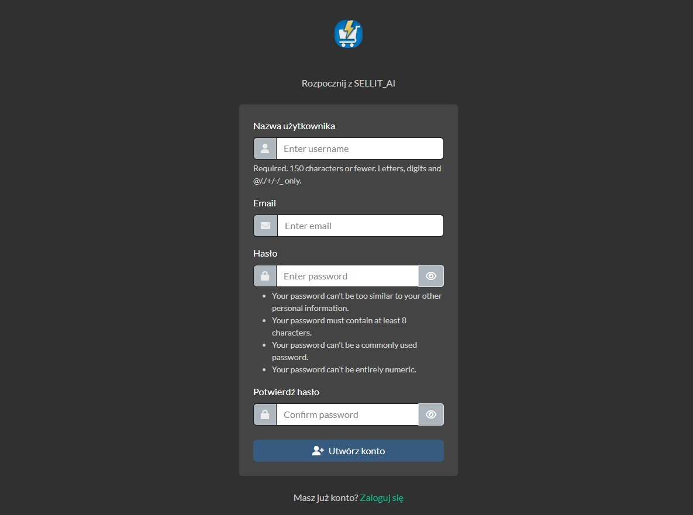
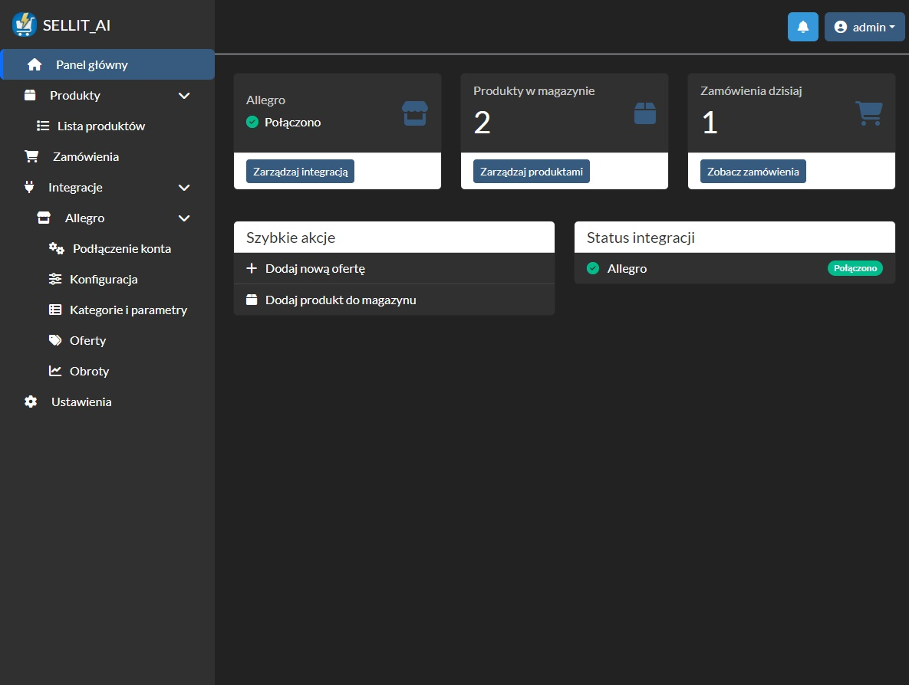
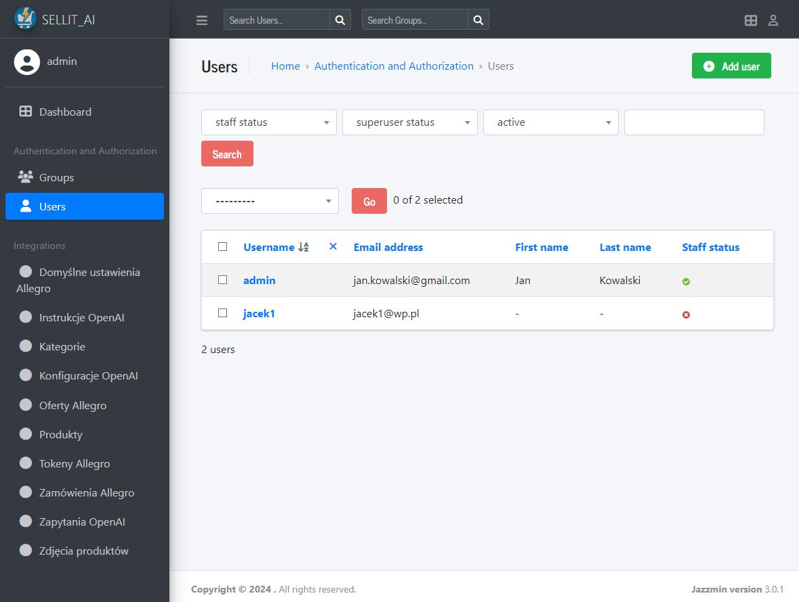
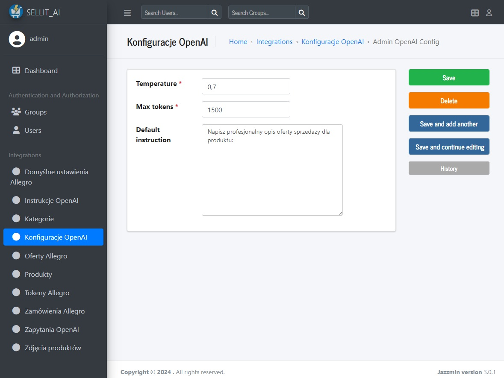
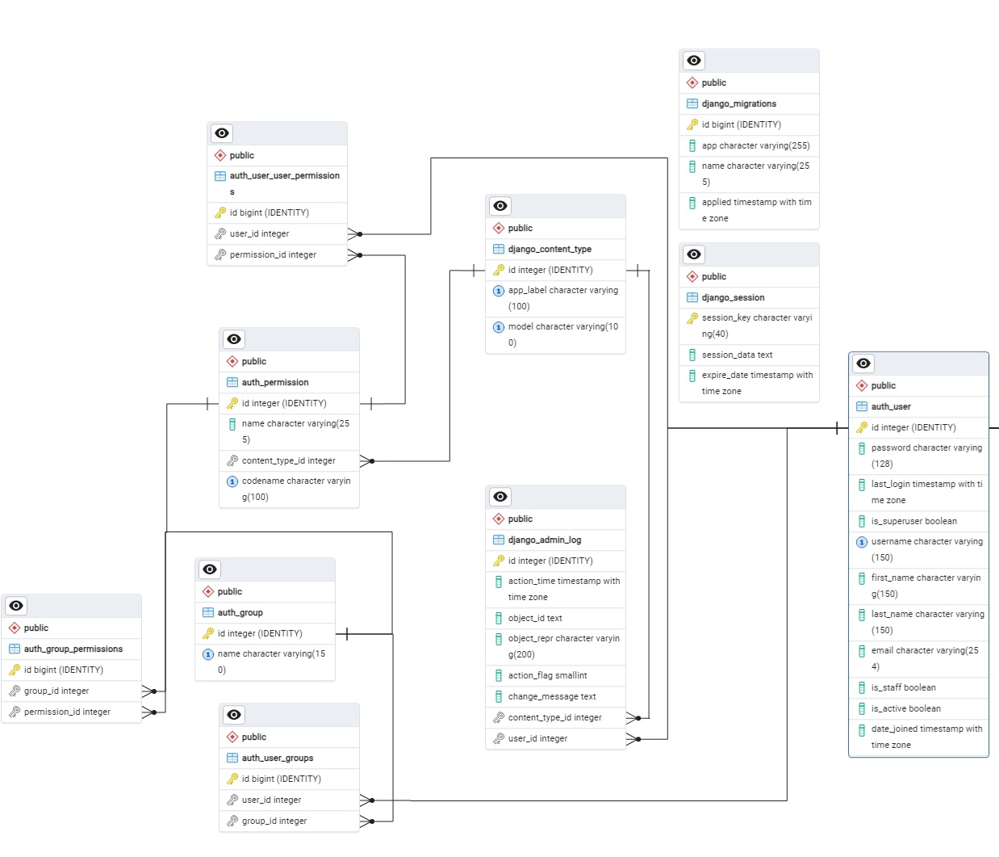
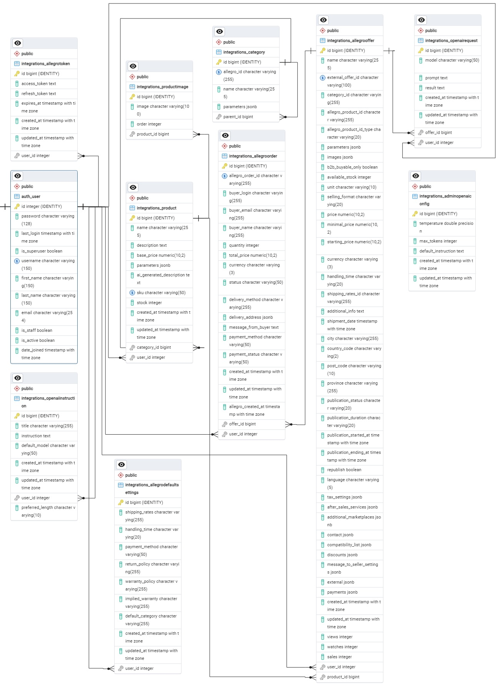
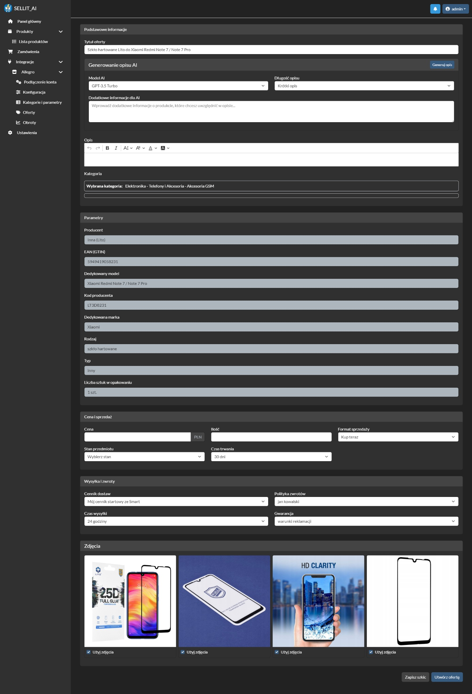
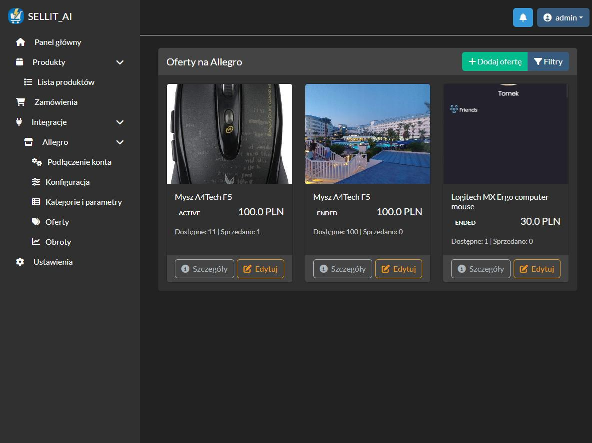

# 📦 SELLIT_AI – Allegro Offer Management with AI 🛒🤖

**SELLIT_AI** is a web-based platform built with Django, PostgreSQL, and Docker, enabling users to manage product listings on the Allegro auction portal. The platform simplifies e-commerce processes by integrating OpenAI for automatic product description generation and providing a user-friendly dashboard for offer and inventory management.

---

## 🚀 Features

- 🔐 User registration and authentication
- 🤝 Allegro API integration (OAuth2 + PKCE)
- 📋 Easy listing management and product templates
- 🧠 AI-based offer description generation using OpenAI
- 📦 Inventory management system
- 🛒 Order tracking from Allegro
- ⚙️ Admin panel with system-wide configuration
- 🐳 Fully containerized with Docker and docker-compose
- 🧠 History tracking of model changes (django-simple-history)
- 🎨 Admin panel customization via Jazzmin

---

## 📷 Screenshots

### Login and Registration


### User Dashboard


### Admin Panel Overview


### OpenAI Settings


### ERD – Models Overview



### Offer Creator with AI Description


### Offer List


---

## ⚙️ Installation

### 1. Clone the repository

```bash
git clone https://github.com/yourusername/sellit_ai.git
cd sellit_ai
```

### 2. Create `.env` file

You must create a `.env` file in the root directory with your secrets:

```dotenv
DATABASE_NAME=...
DATABASE_USER=...
DATABASE_PASSWORD=...
DATABASE_HOST=...
DATABASE_PORT=...
OPENAI_KEY=...
ALLEGRO_CLIENT_ID=...
ALLEGRO_CLIENT_SECRET=...

```

### 3. Build and start services

```bash
docker-compose build
docker-compose up
```

### 4. Run migrations and create superuser

```bash
docker-compose exec web python manage.py migrate
docker-compose exec web python manage.py createsuperuser
```

### 5. Access the app

Visit `http://localhost:8000` for the frontend  
Admin panel is at `http://localhost:8000/admin`

---

## 📒 Technologies Used

- Django 5.1.1
- PostgreSQL
- Docker + docker-compose
- Celery + Redis (background jobs)
- OpenAI API
- Allegro REST API
- Jazzmin (admin panel theme)
- CKEditor, Bootstrap, JQuery

---

## 📄 License

This project is intended for educational and demonstration purposes.
